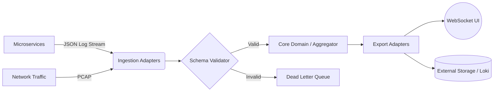

# 👁️ SENTIRIC OBSERVER (v4.0 Sovereign Edition)

[]()
[](docs/01_SENTIRIC_TELEMETRY_STANDARD_SUTS_v4.md)
[](docs/03_OBSERVER_ARCHITECTURE_BLUEPRINT_v4.md)
[]()

> **"Data is the new oil, but Intelligence is the engine."**

**Sentiric Observer**, dağıtık mikroservis mimarileri (Rust, Go, Python, Node.js) için tasarlanmış, **OpenTelemetry (OTel)** uyumlu, gerçek zamanlı bir **Telemetri ve Anomali Tespit Platformudur**.

Sadece log toplamaz; veriyi **anlar**, **ilişkilendirir** (correlation) ve **görselleştirir**. Özellikle Telekom (SIP/RTP) ve Yüksek Trafikli Edge sistemler için optimize edilmiştir.

---

## 🚀 Temel Yetenekler (Key Capabilities)

*   **Carrier-Grade Governance:** Tüm servisler için zorunlu [SUTS v4.0 Standardı](docs/01_SENTIRIC_TELEMETRY_STANDARD_SUTS_v4.md) ile veri bütünlüğü sağlar.
*   **Polyglot Ingestion:** Docker Container'ları, gRPC streamleri ve Ağ Paketlerini (Sniffer) aynı anda işler.
*   **Real-time Intelligence:** Logları bir veritabanına gömüp sonra sorgulamak yerine, **hafızada (In-Memory)** analiz eder ve anlık anomali tespiti yapar.
*   **Hexagonal Architecture:** İş mantığı (Core), dış dünyadan (Adapters) tamamen izole edilmiştir.
*   **Zero-Overhead UI:** WebSocket üzerinden çalışan, binlerce logu saniyeler içinde çizebilen "Matrix Style" arayüz.

---

## 📚 Dokümantasyon (The Constitution)

Bu proje rastgele kodlanmamıştır. Aşağıdaki standartlara sıkı sıkıya bağlıdır:

| Belge | Açıklama |
| :--- | :--- |
| 📜 **[SUTS v4.0 Standardı](docs/01_SENTIRIC_TELEMETRY_STANDARD_SUTS_v4.md)** | Tüm servislerin uyması gereken JSON Log Şeması ve Kuralları. |
| 🏗️ **[Mimari Blueprint](docs/03_OBSERVER_ARCHITECTURE_BLUEPRINT_v4.md)** | Sistemin Hexagonal yapısı, Actor Modeli ve Veri Akışı. |
| 🛠️ **[Implementation Guide](docs/02_LANGUAGE_IMPLEMENTATION_GUIDE_v1.md)** | Rust, Go, Python ve Node.js için entegrasyon rehberi. |
| 🗺️ **[Yol Haritası](docs/04_PROJECT_EXECUTION_ROADMAP.md)** | Faz faz geliştirme planı ve hedefler. |

---

## 🏗️ Sistem Mimarisi (High-Level)



---

## 🛠️ Kurulum ve Çalıştırma

### Gereksinimler
*   Docker & Docker Compose
*   Rust 1.75+ (Geliştirme için)

### Hızlı Başlat (Production Mode)

```bash
# Observer'ı Host Network modunda başlat (Sniffer için gereklidir)
docker-compose up -d --build
```

### Geliştirici Modu (Dev)

```bash
# 1. Projeyi derle
cargo build --release

# 2. Çalıştır (Log seviyesi: INFO)
RUST_LOG=info ./target/release/sentiric-observer
```

---

## 🔌 Portlar ve Erişim

*   **UI Dashboard:** `http://localhost:11070`
*   **gRPC Ingest:** `0.0.0.0:11071`
*   **Metrics:** `http://localhost:11072/metrics`

---

## 🛡️ Lisans ve Katkı

Bu proje **Sentiric Core Team** tarafından geliştirilmektedir.
Standartlara katkıda bulunmak için lütfen önce [RFC Sürecini](docs/) inceleyin.

---
© 2026 Sentiric Platform | *Observability for the Sovereign Cloud*
